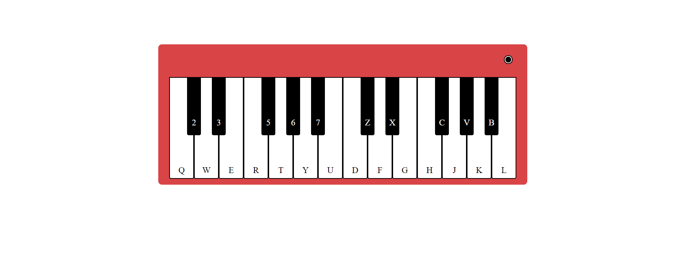

# TECLADO MUSICAL -Jogo de encaixar as peças -  JAVASCRIPT - ES6

- Teclado musical, onde as notas são executadas ao pressionar as respectivas teclas do teclado, assim emitndo seu som.

- Emite som com o mouse também, clicando sobre a tecla.

## Stack utilizada

**Front-end:** HTML, Javascript e CSS.

## Screenshots

## Funcionalidades:

- Ao pressionar a tecla do teclado ou clicar sobre a tecla a mesme emite o respectivo som.

## Referência

  - [Teclado Canal](https://www.youtube.com/watch?v=F9AZkz9QPpA)

   - [Projeto Teclado - site](https://cleytonpinheiro.github.io/teclado-musical-js/)